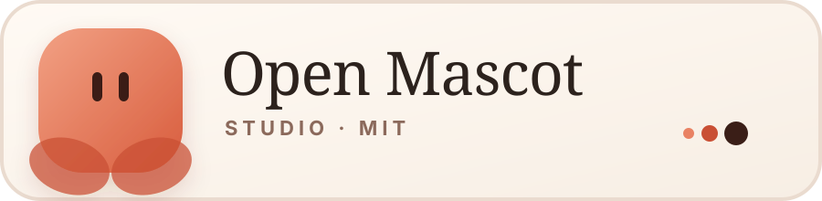
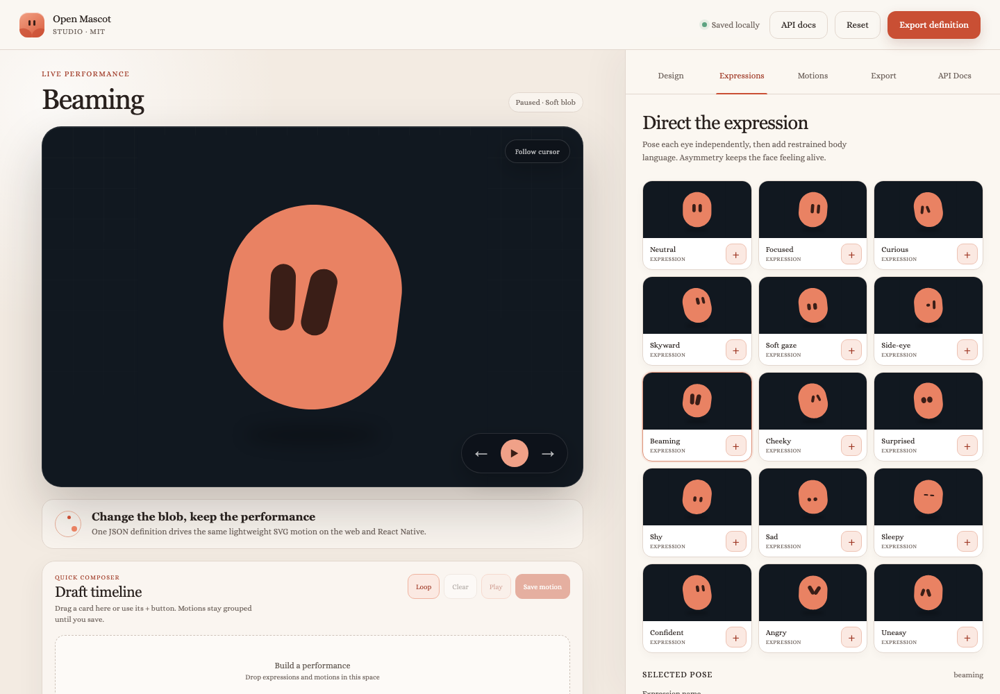
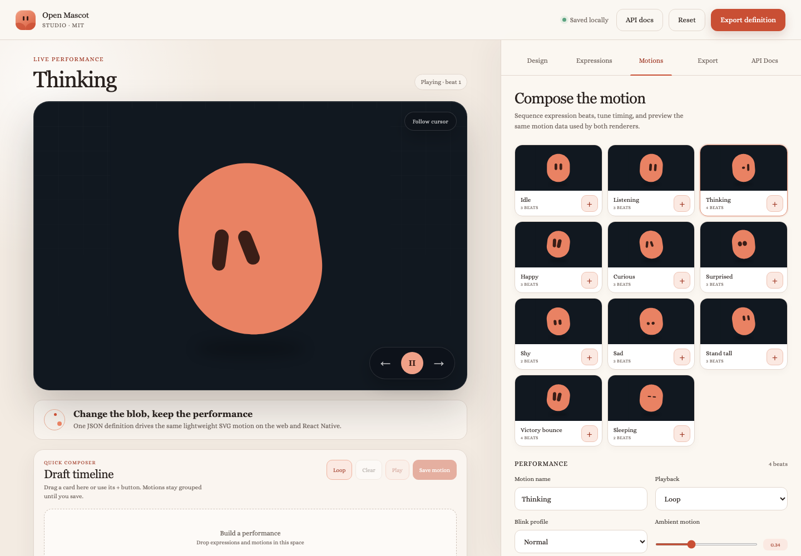

<p align="center">
  
</p>

<p align="center">
  A lightweight vector mascot engine and visual motion studio for the web and React Native.
</p>

<p align="center">
  <a href="./LICENSE"></a>
  
  
  
  
</p>

<p align="center">
  <a href="https://open-mascot-studio.web.app/"><strong>Launch the studio →</strong></a>
  &nbsp;·&nbsp;
  <a href="./packages/open-mascot/">Core API</a>
  &nbsp;·&nbsp;
  <a href="./packages/open-mascot-react-native/">React Native</a>
</p>

<p align="center">
  <a href="https://open-mascot-studio.web.app/">
    
  </a>
</p>

## A character that stays lightweight

Open Mascot turns one portable JSON definition into expressive SVG motion. Design a blob, direct each eye, compose reusable motion, and run the same character through the browser or React Native renderer.

| | |
| --- | --- |
| **Spatial without WebGL** | `projected-3d` adds pitch, yaw, roll, perspective-projected eyes, and natural body deformation using ordinary SVG paths. |
| **A true lightweight mode** | `rigged-2d` keeps the same pose language with a flatter, cheaper renderer. |
| **Motion with personality** | Smooth expression bridges, blinking, micro-saccades, drift, tremble, boing, and cursor-following keep the mascot alive. |
| **Portable by design** | Expressions, motion steps, timing, easing, colors, and geometry all live in one serializable definition. |

## The studio

Shape the mascot without writing code, then export the same definition consumed by the runtimes.

- 7 blob silhouettes, including round, soft, compact, wide, tall, large, and drop
- 2 eye styles with independent scale, placement, rotation, and gaze controls
- 15 editable expressions and 11 composed starter motions
- Drag-and-drop draft timeline with loop, play-once, and local saving
- Live thumbnails, smooth transitions, automatic blinking, and pointer following

<p align="center">
  <a href="https://open-mascot-studio.web.app/?tab=motions&amp;motion=thinking">
    
  </a>
</p>

## Packages

| Package | Purpose |
| --- | --- |
| [`open-mascot`](./packages/open-mascot/) | Definitions, validation, blob presets, motion sampling, scene generation, and the browser SVG runtime |
| [`open-mascot-react-native`](./packages/open-mascot-react-native/) | React Native adapter powered by `react-native-svg` |

The core package has no runtime dependencies. The React Native adapter expects `react`, `react-native`, and `react-native-svg` from the host application.

## Browser API

```js
import { createDefinition } from 'open-mascot'
import { createMascot } from 'open-mascot/web'

const definition = createDefinition({
  name: 'Mallow',
  shape: 'drop',
  color: '#e98263',
  renderMode: 'projected-3d',
})

const mascot = createMascot('#mascot', {
  definition,
  animation: 'idle',
})

mascot.play('happy')
mascot.setExpression('curious')
mascot.setLookTarget({ x: 0.8, y: -0.3 })
mascot.clearLookTarget()
```

Continuous behavior belongs to the expression, so it works in a static preview and inside any motion sequence:

```js
definition.expressions.angry.motion = { body: 'tremble', eyes: 'none' }
definition.expressions.uneasy.motion = { body: 'slow-drift', eyes: 'tremble' }
definition.expressions.beaming.motion = { body: 'boing', eyes: 'none' }
```

## React Native

```jsx
import { createDefinition } from 'open-mascot'
import { OpenMascot } from 'open-mascot-react-native'

const definition = createDefinition({ shape: 'soft' })

export function Character() {
  return (
    <OpenMascot
      definition={definition}
      animation="idle"
      width={240}
      height={240}
    />
  )
}
```

## Run locally

```bash
git clone https://github.com/0oooh/open-mascot-studio.git
cd open-mascot-studio
npm install
npm run dev
```

Open [http://127.0.0.1:4180](http://127.0.0.1:4180). To verify the engine, adapters, declarations, and package contents:

```bash
npm run check
```

## Project boundary

This personal project contains generic primitives, project-specific example definitions, and its own implementation. It ships no company-specific characters, private assets, palettes, links, or product copy.

## License

Open Mascot Studio and both packages are available under the [MIT License](./LICENSE). Copyright © 2026 [0oooh](https://github.com/0oooh).
